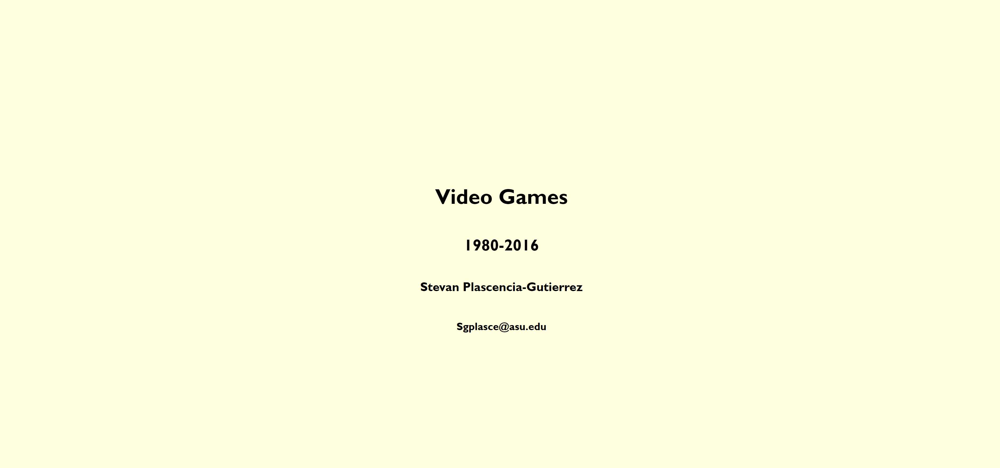
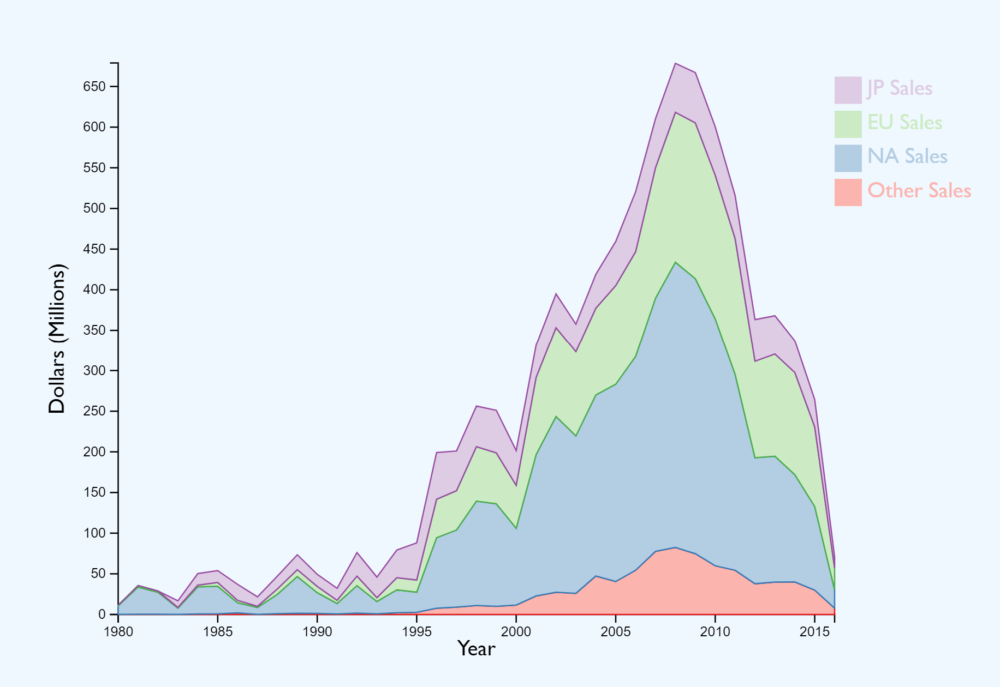
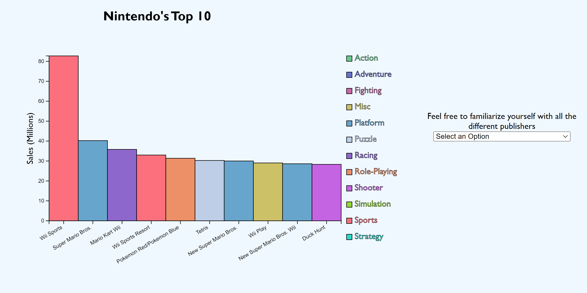
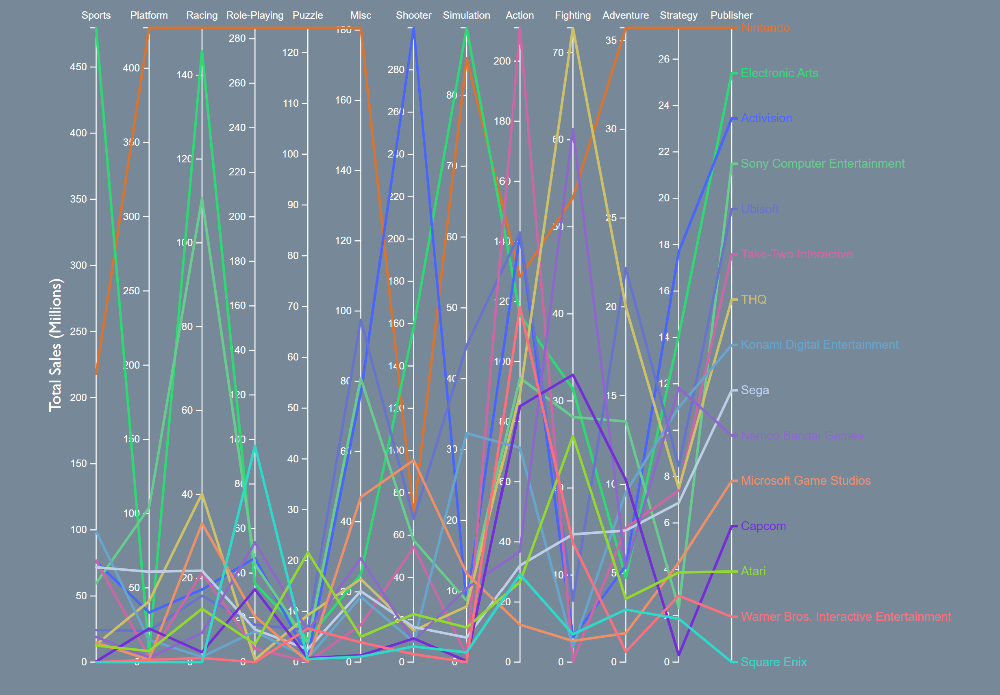
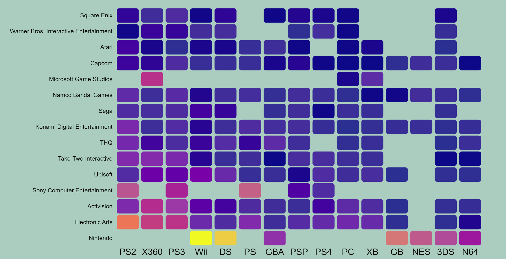
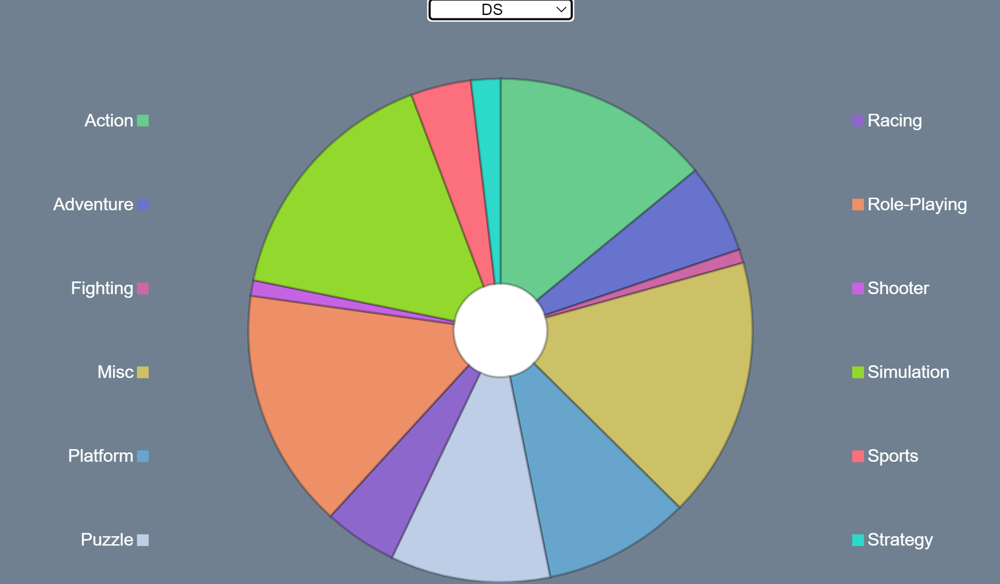
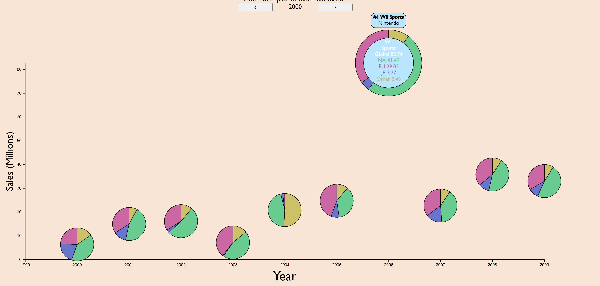

# Video Games
Stevan Plascencia-Gutierrez - Sgplasce@asu.edu

## Overview

My project attempts to teach people about the basics of video game knowledge. It focuses on the Top 15 Publishers and Platforms that are known to most people. It also entertains the user with animations and interactivity.

## Data Description

### Data
#### DataSet: vgsales.csv

Description : Sales of Video Games from 1980 to 2016

[Link](https://www.kaggle.com/datasets/gregorut/videogamesales/code)

Dataset Type: Table

* Attribute: Rank
    * Type: Ordinal 
    * Cardinality: 16600
* Attribute: Name
    * Type: Categorical
    * Cardinality: 11493
* Attribute: Platform
    * Type: Categorical
    * Cardinality: 31
* Attribute: Year
    * Type: Quantative, Sequential
    * Cardinality: 1980-2016
* Attribute: Genre
    * Type: Categorical
    * Cardinality: 12
* Attribute: Publisher
    * Type: Categorical
    * Cardinality: 579
* Attribute: NA_Sales
    * Type: Quantative, Sequential
    * Cardinality:  0-41.5
* Attribute: EU_Sales
    * Type: Quantative, Sequential
    * Cardinality:  0-29
* Attribute: JP_Sales
    * Type: Quantative, Sequential
    * Cardinality: 0-10.2
* Attribute: Other_Sales
    * Type: Quantitative, Sequential
    * Cardinality: 0-10.6
* Attribute: Global_Sales
    * Quantative, Sequential
    * Cardinality: 0.1-82.7

 Dataset Availability: Static

Preprocessing: Preproccessed a little bit of data for the first graph, took sums of NA_Sales, EU_Sales, JP_Sales, and Other_Sales. Was stored into saleTrends.csv

## Goals and Tasks

My main goal is to create something people would enjoy

* Enjoy & Compare Trends of Regional Sales
* Enjoy & Explore Distribution of Publisher's Top Selling Games
* Enjoy & Compare Correlations of Publisher's Genre Sales
* Enjoy & Explore Dependencies of Publisher's on Platforms
* Enjoy & Browse Distributions of Platform's Genre Sales
* Enjoy & Explore Features of Games of the Year 

## Idioms

Brief: I designed an interface with user interactivity in mind. All my idioms have some level of interactivity, even it is just a simple hovering feature. Alot of the colors I chose for the simple reason that I think they look nice.

### Stacked Area

Rationale: I wanted to present a general idea to the user about sales over time. Stacked Area Allowed for that, and wanted the user to focus on one area at time so I added the hover feature.

Encoding: Sales Region is encoded by color. Sale Amount over time is encoded by area.

Interactiviy: Users can hover over graph to focus region

### Bar

Rationale: I chose the bar graph so that I could convey a publisher's top games in a simple manner to the user. I chose to color the genres so that the user can easily see the type of games the publisher makes. I represented the sales through length so that the user could easily see the difference in the top selling games. I added the hover ability in case the user has trouble telling colors apart.

Encoding: Sales is encoded by bar length. Genre is encoded by Color. Name is encoded by X-Position  

Interactivity: User can hover over labels to focus genre. User can also change the Publisher using select.

### Parallel Line

Rationale: I chose the parallel line graph so that I could show how the publishers all compare with eachother in different genres. I chose to represent the Genre with the X-Position since there were fewer categories. I then color coded the Publishers to allow the user to tell them apart easier. I added a hover functionality because it is cluttered and it could be hard to see some.

Encoding: Sales is encoded by Y-Position. Genre is encoded by X-Position. Publisher is Encoded by Color, Line.

Interactivity: User can hover over line or label to focus publisher.

### Heat Map

Rationale: I chose a heatmap because I needed a not too cluttered way to compare so many entries. I set the platform as the X-Position because the names were shorter. I added the tooltip because displaying accuracy is a heatmaps weakness.

Encoding: Publisher is encoded by Y-Position. Platform is encoded by X-Position. Sales is encoded by Saturation.

Interactivity: Tooltip shows value of cell.

### Donut

Rationale: I chose a donut chart because it is simple and very aesthetically pleasing. I chose to make display Genres by color since there are a few amount of them. I added the hover functionality to fix the lack of accuracy donut charts have.

Encoding: Genre is encoded by color. Sales is encoded by area.

Interactivity: User can hover over area to focus and show sales of genre. User can also choose platform using a select.

### Innovative - ScatterDonutPie 

Rationale: I wanted a way to incorporate a scatterplot to show off the best games but also allow the user to see everything. At the same time I didn't want it to be too cluttered. So I minimized the dots 

Encoding: Year is encoded by X-Position. Sales is encoded by Y position. Region is encoded by color.

Interactivity: User can Hover over pie to view all information.
User can go change decade using buttons.

## Reflection

My project has changed alot from the Initial proposal and WIP. Initially I was going to cover evolution of video games, however that was much harder to get different graphs to visualize so instead I took advantage of all the categorical data provided and focused on relationships. The original proposal was not very realistic as there are only so many ways to visualize evolution with the limited amount of sequential data I had. I was able to do more than I expected especially in terms of animation and chart design quality, however I wanted to incorporate more scrolly telling with connection to the visualizations but I only ran into issues, and it was difficult to find documentation on how to use graph-scroll.js. Next time I would work with a different scrolly telling package, I would also find a better dataset I felt as if the dataset I used was a bit lackluster and hard to derive any insightful information from it. I did extremeley enjoy the visualization design of this project but abosolutley did not like the HTML5 design aspecs of the project.

## Team Workload

As a solo member team I did everything

